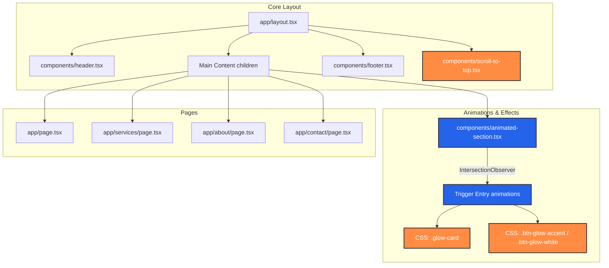
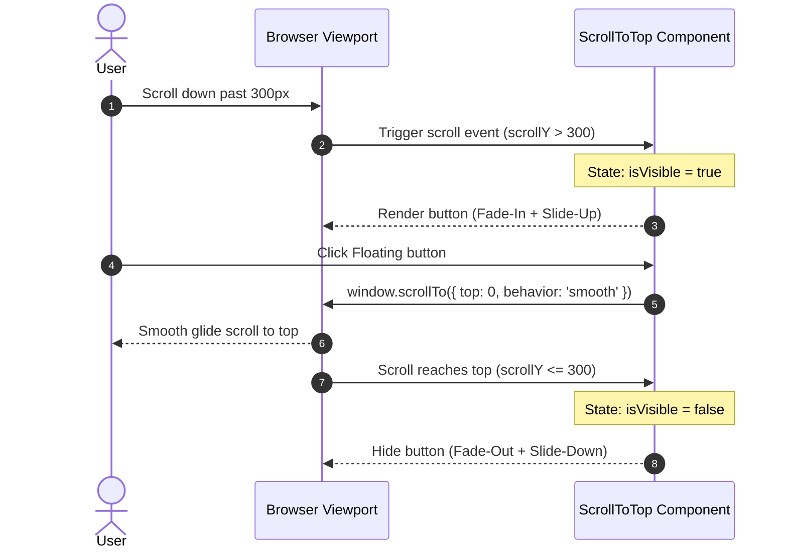

# Visual Implementation Plan: Website Aesthetics & Glow Updates

This document presents the visual layout designs, structural component flows, and behavioral architecture for the planned website upgrades.

---

## 1. System Component Architecture

The diagram below illustrates the relationship between the layout, routing, custom animation components, and page-specific layouts.



---

## 2. Scroll-to-Top Button Interactions

The floating button handles scroll event tracking and user click events as shown:



---

## 3. CTA Button Improvements (Before & After)

The following table maps the improvement in copy and glowing styling:

| Component Location | Current Text | New Action-Oriented Text | Glow Styling Effect | Class Name |
| :--- | :--- | :--- | :--- | :--- |
| **Hero (Primary)** | `Get Your Free Quote` | **Claim Your Free Inspection** | Intense Accent Orange Glow | `.btn-glow-accent` |
| **Hero (Secondary)** | `Explore Services` | **Explore Premium Services** | Ambient White Glow | `.btn-glow-white` |
| **Header Nav** | `Get Quote` | **Get Free Estimate** | Subtly Pulsing Accent Glow | `.btn-glow-accent` |
| **Services Preview** | `View All Services` | **Browse All Premium Services**| Transparent Accent Border Glow | `.btn-glow-outline` |
| **Bottom Page CTA** | `Schedule Your Consultation` | **Schedule Your Free Consultation**| Active Orange Glow | `.btn-glow-accent` |
| **Services Page** | `Get a Free Quote` | **Claim Your Free Quote** | Active Orange Glow | `.btn-glow-accent` |
| **About Page** | `Get Started` | **Get Started With Apex** | Active Orange Glow | `.btn-glow-accent` |
| **Contact Page** | `Send Message` | **Submit Your Request** | Active Orange Glow | `.btn-glow-accent` |
| **Contact (Footer-CTA)**| `Call Now` | **Call Now** | Ambient White Glow | `.btn-glow-white` |

---

## 4. Redesigned "Our Process" Section (Services Page)

The process section shifts from simple text nodes to highly interactive, staggered card layouts connected by subtle visual elements.

```
+---------------------------------------------------------------------------------------------------+
|                                            OUR PROCESS                                            |
|                              Step-by-step Quality Assurance System                                 |
+---------------------------------------------------------------------------------------------------+
|                                                                                                   |
|  +--------------------+      +--------------------+      +--------------------+      +----------+  |
|  | [Icon]          01 |      | [Icon]          02 |      | [Icon]          03 |      | [Icon]04 |  |
|  |                    | ---> |                    | ---> |                    | ---> |          |  |
|  | Assessment         |      | Transparent Quote  |      | Flexible Schedule  |      | Quality  |  |
|  | Free inspections   |      | Detailed estimate  |      | Timing & Safety    |      | Complete |  |
|  +--------------------+      +--------------------+      +--------------------+      +----------+  |
|         Card 1                      Card 2                      Card 3                 Card 4     |
|      (Delay: 0ms)               (Delay: 150ms)              (Delay: 300ms)          (Delay: 450ms)|
|      [Glow Border]              [Glow Border]               [Glow Border]           [Glow Border] |
+---------------------------------------------------------------------------------------------------+
```

### Visual Features of the New Process Cards:
1. **Neon Badges**: Top-right corner indicators (`01` through `04`) styled in high-opacity accent text (`text-accent font-mono font-bold text-3xl`).
2. **Action Icons**: Built with responsive Lucide-react icons that scale up and glow on hover.
3. **Connecting Arrows**: Subtle right-pointing chevrons (`ChevronRight`) displayed on desktop view (`hidden md:block`) between steps to reinforce flow.
4. **Interactive Hover Glow**: Interactive cards scale up by `4px` and project a surrounding shadow mapped to the theme accent.

---

## 5. Visual Glow Aesthetics (CSS Mapping)

```css
/* Card Glow Styling Layout */
.glow-card {
  box-shadow: 0 4px 20px rgba(0, 0, 0, 0.05);
  border: 1px solid var(--border);
  transition: all 0.4s cubic-bezier(0.16, 1, 0.3, 1);
}
.glow-card:hover {
  border-color: rgba(255, 140, 66, 0.5); /* Accent Glow Border */
  box-shadow: 0 0 25px rgba(255, 140, 66, 0.12), 
              0 10px 30px rgba(0, 0, 0, 0.08); /* Accent outer glow */
  transform: translateY(-4px);
}

/* Button Glow Styling Layout */
.btn-glow-accent {
  background-color: var(--accent);
  box-shadow: 0 0 15px rgba(255, 140, 66, 0.35); /* Steady Glow */
}
.btn-glow-accent:hover {
  box-shadow: 0 0 25px rgba(255, 140, 66, 0.65), 
              0 0 40px rgba(255, 140, 66, 0.25); /* Intense Glow on Hover */
  transform: translateY(-2px) scale(1.02);
}
```
